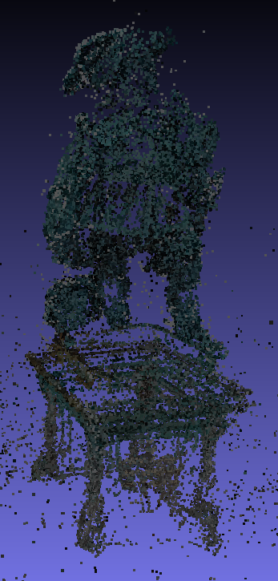
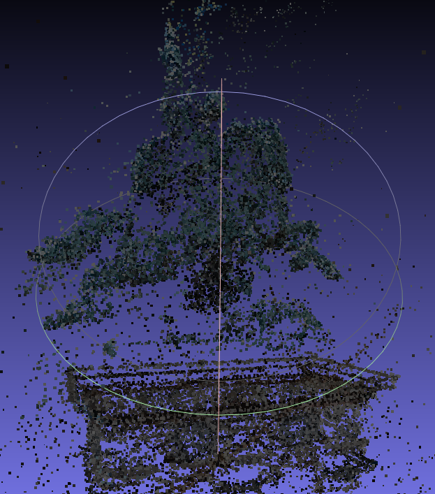

# Incremental SFM Pipeline using SIFT Feature Tracking

Structure for Motion (SfM) pipeline for generating sparse point clouds using SIFT feature tracking. This pipeline uses the SIFT algorithm for feature tracking, followed by essential matrix estimation, pose recovery, triangulation, and bundle adjustment for optimizing the point cloud.


Used this repo '''https://github.com/rshilliday/sfm/tree/master''' for reference,
Perfomed SFM on vercigetorix dataset for which I have a known Intrinsic Matrix, to achieve satisfactory results.
## Getting Started 

1. Clone the repository:

    ```bash
    git clone https://gitlab.com/mayur1998/eece-7150.git
    cd HW4
    ```

2. Run the main script:

    ```bash
    python main.py
    ```
   or 

   ```
   run sfm.ipynb
   ```


    - Input the intrinsic parameters according to your camera and the dataset containing the images.

3. Use MeshLab for Visualization:

    - View the optimized point cloud using MeshLab.

## Dataset

The pipeline has been tested on the "vercingetorix" dataset, which contains images captured in a circular pattern using a Nikon camera.

## Pipeline Steps

1. **Import Images:**
   - Import the dataset images.

2. **SIFT Feature Tracking:**
   - Use SIFT feature tracking to identify matching points.

3. **KNN Matching:**
   - Use Brute Force KNN matching with Lowe's test to identify good features.

4. **Essential Matrix Estimation:**
   - Estimate the essential matrix to recover pose using RANSAC outlier filtering.

5. **Projection Matrix:**
   - Create the projection matrix using rotation and translation matrices.

6. **Triangulation:**
   - Triangulate points to obtain 3D world coordinates from the image plane.

7. **Reprojection Error:**
   - Compute the reprojection error by comparing 3D points reprojected to the image plane.

8. **PnP Pose Estimation:**
   - Calculate the pose using PnP pose estimation with common features between images.

9. **Optimized Triangulation:**
   - Triangulate keypoints to calculate optimized world coordinates.

10. **Repeat Pipeline:**
    - Repeat the pipeline for newly added images.

## Point Cloud





